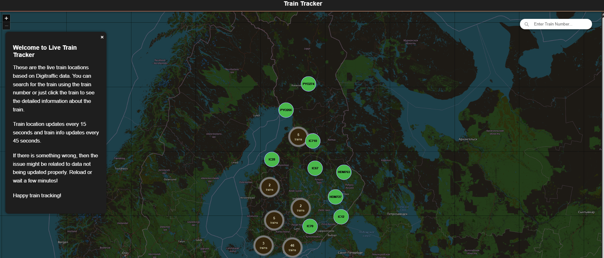
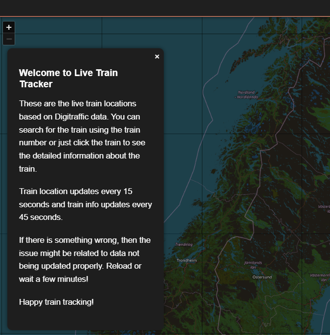
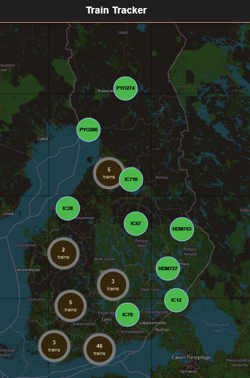
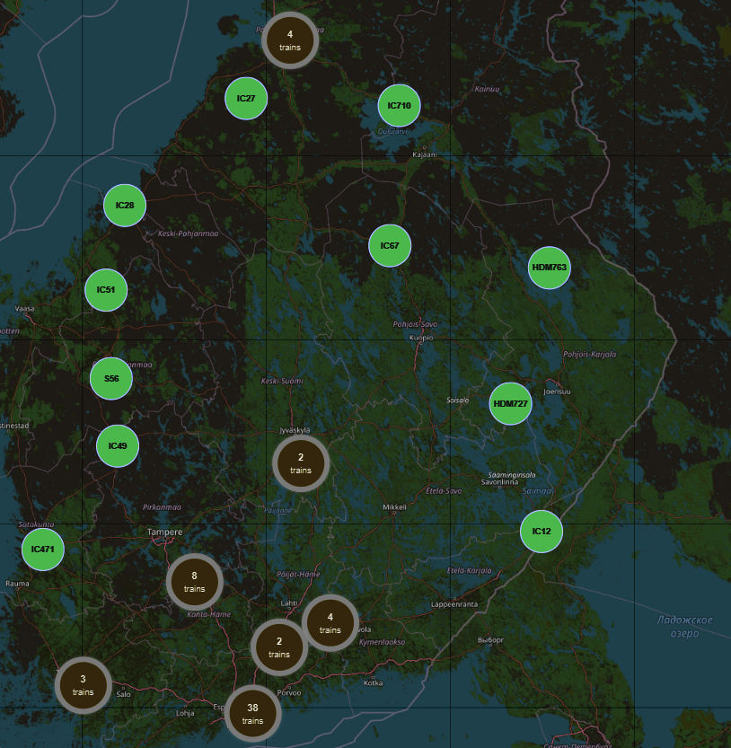
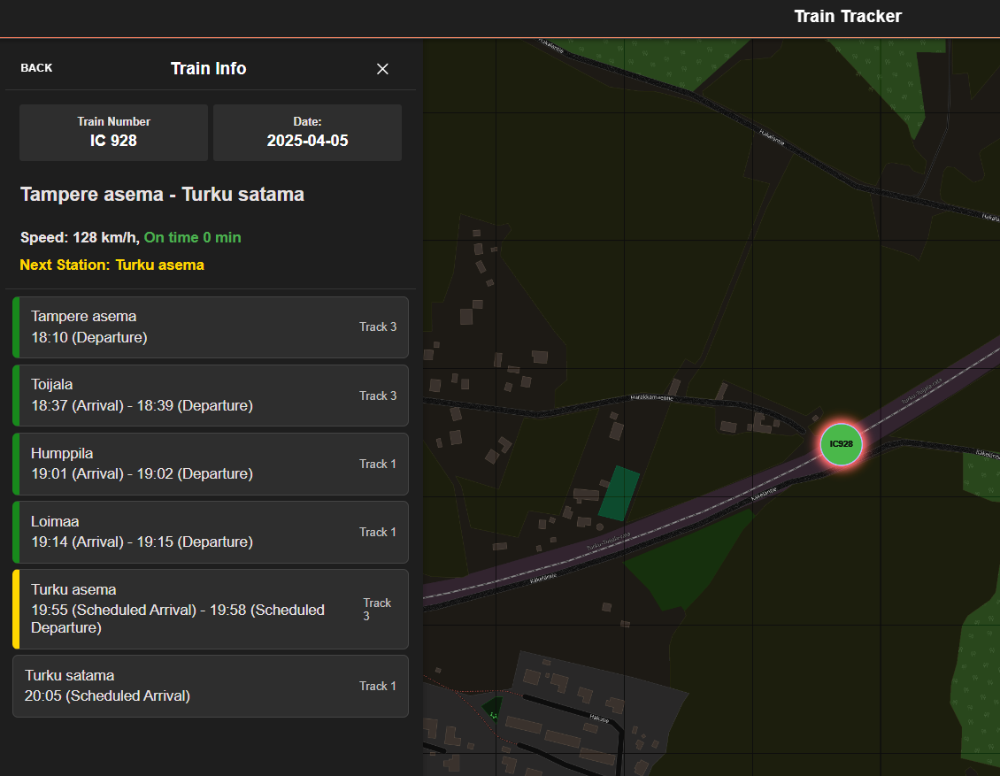
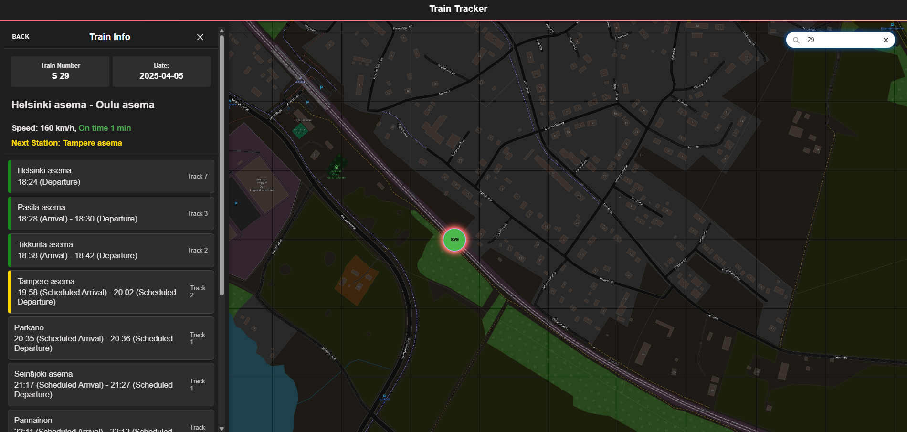

# Live Train Tracker

**Live Train Tracker** is a modern web app built with **Ionic Vue** that visualizes live train locations in Finland using the [DigiTraffic API](https://www.digitraffic.fi/). The app shows real-time positions of trains on a map with options to get detailed information for each train. Location updates every 15 seconds, and train info updates every 45 seconds.

---

## Features

- **Map UI** with real-time train markers.
- **Automatic Updates** for locations (15s) and train details (45s).
- **Train Search** by number.
- **Train Details Popup** with info from DigiTraffic.
- Train information with time and each stations

---

## Technologies Used

- **Vue Js**
- **Ionic Vue** (UI framework)
- **Leaflet.js** (interactive map)
- **DigiTraffic API** (Finnish Transport Infrastructure Agency)
- **Vite** (build tool)
- **CSS** for styling

---

## Installation

### Prerequisites

- Node.js >= 22
- NPM or Yarn
- Git (for cloning the repo)

### 1. Clone the Repository

```bash
git clone https://github.com/zprakash/trainTracker.git
cd trainTracker
```

### 2. Install Dependencies

```bash
npm install
# or
yarn install
```

### 3. Run the Project

```bash
ionic serve
```

The app will open in your default browser at `http://localhost:8100`.

---

## 📸 Screenshots

### Home Page


### Welcome message


### TrainMarkers



### Train Information


### Train Search


---

## Usage

Once the application is running:

- Wait for the map and train markers to load.
- Use the search box (if available) to find a train and related information by its number.
- Click on any train marker to view its speed, direction, schedules, stops and other detailed information.
- The map updates automatically, no need to refresh.

---


## 💬 Contribution

Pull requests are welcome! For major changes, please open an issue first to discuss what you would like to change.

---

## 📄 License

MIT License 
